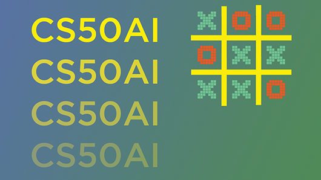
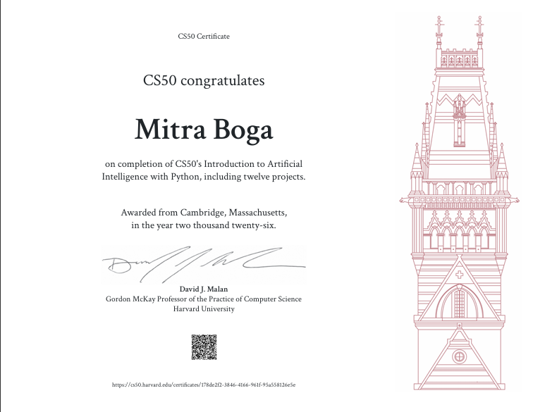

<div align="center">

# CS50AI

### Harvard CS50's Introduction to Artificial Intelligence with Python — 12 Project Portfolio

<p align="center">
  
  
  
  
  
  
  
  
  
</p>



</div>

---

## 🚀 About This Repository

This repository contains my completed project work for **Harvard CS50's Introduction to Artificial Intelligence with Python**.

I completed all **12 CS50AI projects**, covering the full course journey from classical search algorithms to modern transformer-based natural language processing. Completing these projects earned me the **CS50AI Certificate from Harvard University**, validating my hands-on understanding of core artificial intelligence concepts and my ability to implement them in Python.

This repository is more than a course archive.

It is a portfolio of AI foundations.

Each project represents a different layer of intelligent systems: how machines search, reason, predict, learn, and understand language.

CS50AI covers the core ideas behind modern artificial intelligence, including:

- Search algorithms
- Game-playing AI
- Knowledge representation
- Logical inference
- Uncertainty
- Bayesian networks
- Markov models
- Constraint satisfaction problems
- Supervised machine learning
- Reinforcement learning
- Neural networks
- Natural language processing
- Transformer-based attention models

---

# 🎓 CS50AI Certificate

Completing all 12 CS50AI projects earned me the **CS50AI Certificate from Harvard University**.

This certificate represents my completion of Harvard's artificial intelligence curriculum, including hands-on work across search, logic, probability, optimization, machine learning, neural networks, and natural language processing.

<p align="center">
  
</p>

---

## 🧠 What I Learned

Through these 12 projects, I strengthened my understanding of how intelligent systems think, search, reason, predict, and learn.

This repository represents my foundation in:

1. **Classical AI**
   - Search
   - Logic
   - Constraint satisfaction
   - Knowledge-based agents

2. **Probabilistic AI**
   - Bayesian inference
   - Markov chains
   - Probability distributions
   - Uncertainty modeling

3. **Machine Learning**
   - Classification
   - Model evaluation
   - Reinforcement learning
   - Neural networks

4. **Natural Language Processing**
   - Context-free grammar parsing
   - Masked language modeling
   - Transformer attention analysis

This is where I connected AI theory with real implementation.

Not just “what is AI?”

But **how does AI actually work under the hood?**

---

# 📚 CS50AI Project Collection

## 1. Degrees

**Concept:** Search Algorithms  
**Core Technique:** Breadth-First Search

This project finds the shortest connection between two actors using movie co-star relationships.

The program models actors as states and movies as actions. Using breadth-first search, it determines the minimum number of “degrees of separation” between two actors.

### Key Ideas

- Graph search
- Shortest path discovery
- Breadth-first search
- State-space modeling
- Frontier-based exploration

---

## 2. Tic-Tac-Toe

**Concept:** Game-Playing AI  
**Core Technique:** Minimax

This project implements an unbeatable Tic-Tac-Toe AI using the Minimax algorithm.

The AI evaluates all possible future board states and selects the optimal move for the current player. With correct play, the AI cannot be beaten.

### Key Ideas

- Adversarial search
- Minimax decision-making
- Terminal state evaluation
- Utility functions
- Optimal game strategy

---

## 3. Knights

**Concept:** Knowledge Representation  
**Core Technique:** Propositional Logic + Model Checking

This project solves Knights and Knaves logic puzzles.

Each character is either a knight who always tells the truth or a knave who always lies. The AI represents puzzle statements using propositional logic and uses model checking to determine which conclusions must be true.

### Key Ideas

- Logical symbols
- Knowledge bases
- Entailment
- Model checking
- Propositional logic

---

## 4. Minesweeper

**Concept:** Knowledge-Based AI  
**Core Technique:** Logical Inference

This project builds an AI agent that plays Minesweeper by reasoning about safe cells and mines.

The AI stores logical sentences about the board and uses inference rules to mark cells as safe or dangerous. When no guaranteed safe move exists, it falls back to a random move.

### Key Ideas

- Knowledge-based agents
- Inference from constraints
- Logical sentence simplification
- Safe move selection
- Uncertainty handling

---

## 5. PageRank

**Concept:** Probabilistic Models  
**Core Technique:** Markov Chains + Iterative Ranking

This project implements the PageRank algorithm used to rank web pages by importance.

The program calculates page importance using two approaches:

1. Sampling from a random surfer model
2. Iteratively applying the PageRank formula

PageRank models the web as a graph and estimates how likely a random user is to land on each page.

### Key Ideas

- Markov chains
- Random surfer model
- Damping factor
- Iterative convergence
- Link analysis
- Probability distributions

---

## 6. Heredity

**Concept:** Uncertainty  
**Core Technique:** Bayesian Inference

This project estimates the probability that individuals carry a genetic trait based on family relationships and observable evidence.

The AI uses joint probability, inheritance rules, mutation probability, and normalization to calculate probability distributions for each person's gene copies and trait expression.

### Key Ideas

- Bayesian networks
- Joint probability
- Conditional probability
- Genetic inheritance modeling
- Normalization
- Probabilistic inference

---

## 7. Crossword

**Concept:** Constraint Satisfaction Problems  
**Core Technique:** Backtracking Search + Arc Consistency

This project generates crossword puzzles by assigning words to crossword slots while satisfying constraints.

The AI treats each word slot as a variable, each possible word as a domain value, and overlaps between words as binary constraints.

### Key Ideas

- Constraint satisfaction
- Node consistency
- Arc consistency
- AC-3 algorithm
- Backtracking search
- Minimum remaining values heuristic
- Least-constraining value heuristic

---

## 8. Shopping

**Concept:** Supervised Machine Learning  
**Core Technique:** k-Nearest Neighbors Classification

This project predicts whether an online shopping user will complete a purchase.

The model uses user session data such as page visits, durations, bounce rates, traffic type, visitor type, weekend activity, and other features to classify whether revenue will be generated.

### Key Ideas

- Classification
- k-nearest neighbors
- Feature preprocessing
- Train-test split
- Sensitivity
- Specificity
- Model evaluation

---

## 9. Nim

**Concept:** Reinforcement Learning  
**Core Technique:** Q-Learning

This project builds an AI that teaches itself to play Nim through self-play.

The AI learns Q-values for state-action pairs. Over thousands of training games, it discovers which moves lead to winning outcomes and which moves should be avoided.

### Key Ideas

- Reinforcement learning
- Q-learning
- Rewards and penalties
- Exploration vs exploitation
- Epsilon-greedy strategy
- Self-play training

---

## 10. Traffic

**Concept:** Computer Vision  
**Core Technique:** Convolutional Neural Networks

This project uses TensorFlow to classify traffic signs from images.

The AI trains on the German Traffic Sign Recognition Benchmark dataset and learns to identify 43 categories of road signs using image preprocessing and a neural network model.

### Key Ideas

- Deep learning
- Computer vision
- Image classification
- Convolutional neural networks
- TensorFlow
- OpenCV
- Model experimentation

---

## 11. Parser

**Concept:** Natural Language Processing  
**Core Technique:** Context-Free Grammar Parsing

This project parses English sentences and extracts noun phrase chunks.

The AI uses context-free grammar rules to generate parse trees and identify meaningful noun phrases inside a sentence.

### Key Ideas

- Natural language processing
- Tokenization
- Context-free grammar
- Parse trees
- Noun phrase extraction
- NLTK

---

## 12. Attention

**Concept:** Transformer-Based NLP  
**Core Technique:** BERT Masked Language Modeling + Attention Visualization

This project uses BERT to predict masked words in a sentence.

It also generates visualizations for BERT’s self-attention heads, helping analyze how different tokens attend to each other inside a transformer model.

### Key Ideas

- Transformers
- BERT
- Masked language modeling
- Self-attention
- Attention head visualization
- Hugging Face Transformers
- NLP interpretability

---

# 🌟 Featured Enhanced Projects

After completing the full CS50AI project set, I chose **three projects** to take beyond the course specification.

These were not just submitted as academic assignments.

I selected them because they represent three different pillars of artificial intelligence:

1. **Reinforcement Learning**
2. **Graph-Based Ranking Systems**
3. **Transformer-Based Natural Language Processing**

The goal was simple:

> Take strong CS50AI foundations and rebuild selected projects into more polished, industry-standard, production-ready portfolio projects.

These enhanced versions combine what I learned from:

- Harvard CS50AI
- My B.Tech Computer Science and Engineering degree
- Data Structures and Algorithms
- Machine Learning coursework
- Deep Learning coursework
- Software Engineering principles
- Cloud and DevOps project experience
- Previous full-stack and AI portfolio projects

This is where the course work became something bigger.

Not just assignments.

**Portfolio-grade AI systems.**

---

## ⭐ Enhanced Project 1: Nim

### From Course Project to Reinforcement Learning Playground

The original CS50AI Nim project focuses on Q-learning through self-play.

For the enhanced version, I expanded the idea into a more complete reinforcement learning project that better demonstrates how agents learn from experience.

### Original CS50AI Version

The course version implements:

- Nim game environment
- Q-value storage
- Q-learning update rule
- Epsilon-greedy action selection
- Self-play training loop
- Human vs AI gameplay

### Enhanced Direction

The enhanced version can showcase:

- Cleaner RL environment structure
- Training analytics
- Win-rate tracking
- Q-table inspection
- Configurable training episodes
- Strategy evaluation
- Improved CLI or UI experience
- Documentation explaining reinforcement learning in simple terms

### Why I Enhanced Nim

Nim is a perfect foundation for understanding how machines learn through trial and error.

It shows the heart of reinforcement learning:

> An agent takes actions, receives feedback, and slowly learns better decisions.

That idea powers robotics, game AI, recommendation systems, autonomous systems, and real-world decision engines.

### Enhanced Repository

[View Enhanced Nim Project](https://github.com/YOUR_USERNAME/YOUR_NIM_REPO)

---

## ⭐ Enhanced Project 2: PageRank

### From Algorithm Assignment to Graph Intelligence System

The original CS50AI PageRank project implements Google’s classic ranking algorithm using both sampling and iterative convergence.

For the enhanced version, I treated PageRank as more than a search-engine concept.

I rebuilt it as a graph intelligence project.

### Original CS50AI Version

The course version implements:

- Corpus crawling
- Link graph construction
- Transition model
- Random surfer sampling
- Iterative PageRank calculation
- Damping factor handling
- Convergence thresholding

### Enhanced Direction

The enhanced version can showcase:

- Graph visualization
- Interactive ranking exploration
- Custom webpage or document corpus support
- Comparison between sampling and iteration
- Ranking explainability
- Network analysis metrics
- Cleaner modular architecture
- Potential dashboard or API layer

### Why I Enhanced PageRank

PageRank is one of the most important algorithms in internet history.

But the deeper lesson is bigger than web pages.

PageRank teaches how importance flows through a network.

That applies to:

- Search engines
- Citation networks
- Social graphs
- Recommendation systems
- Knowledge graphs
- Dependency graphs
- Trust and influence scoring

### Enhanced Repository

[View Enhanced PageRank Project](https://github.com/YOUR_USERNAME/YOUR_PAGERANK_REPO)

---

## ⭐ Enhanced Project 3: Attention

### From BERT Visualization to Transformer Interpretability

The original CS50AI Attention project uses BERT to predict masked words and generate attention diagrams.

For the enhanced version, I focused on making transformer attention more understandable, visual, and useful.

### Original CS50AI Version

The course version implements:

- BERT masked word prediction
- Mask token detection
- Attention score color mapping
- Attention diagram generation
- Human interpretation of attention heads
- Analysis of token relationships

### Enhanced Direction

The enhanced version can showcase:

- Cleaner attention visualizations
- Better explanation of transformer internals
- Layer/head comparison
- Token-to-token attention exploration
- Example sentence library
- Interpretability notes
- Streamlit or web-based interface
- Stronger NLP portfolio documentation

### Why I Enhanced Attention

Modern AI is powered by transformers.

Large language models, coding assistants, search systems, chatbots, summarizers, and AI agents all rely on attention mechanisms.

This project helped me understand a key question:

> When a model reads a sentence, what is it paying attention to?

That question is central to NLP, explainable AI, and modern LLM systems.

### Enhanced Repository

[View Enhanced Attention Project](https://github.com/YOUR_USERNAME/YOUR_ATTENTION_REPO)

---

# 🧩 Why These 3 Projects Matter Together

I chose **Nim, PageRank, and Attention** because together they form a powerful AI learning arc.

## 1. Nim — Learning from Experience

Nim represents agents that improve through feedback.

This connects to:

- Reinforcement learning
- Decision-making systems
- Autonomous agents
- Game AI
- Optimization through self-play

## 2. PageRank — Ranking by Network Structure

PageRank represents intelligence over graphs and relationships.

This connects to:

- Search engines
- Recommendation systems
- Graph analytics
- Network science
- Authority and trust scoring

## 3. Attention — Understanding Language Context

Attention represents modern NLP and transformer-based intelligence.

This connects to:

- Large language models
- Chatbots
- Semantic search
- Prompt engineering
- AI interpretability
- Context-aware systems

Together, these three projects show a strong range:

| Project | AI Area | Main Skill Demonstrated |
|---|---|---|
| Nim | Reinforcement Learning | Learning optimal actions through experience |
| PageRank | Graph Algorithms | Ranking importance across connected systems |
| Attention | NLP / Transformers | Understanding language through contextual attention |

This combination shows that I am not only learning AI from one angle.

I am building across the full stack of AI thinking:

**decision-making, ranking, reasoning, and language understanding.**

---

# 🛠️ Tech Stack

## Languages

- Python 3.12

## AI / ML Concepts

- Search
- Minimax
- Propositional logic
- Model checking
- Bayesian inference
- Markov chains
- Constraint satisfaction
- k-nearest neighbors
- Q-learning
- Neural networks
- Context-free grammar
- Transformer attention

## Libraries and Tools

- pygame
- scikit-learn
- TensorFlow
- OpenCV
- NLTK
- Hugging Face Transformers
- NumPy
- pandas
- Pillow

---

# 📁 Repository Structure

```text
CS50AI/
│
├── degrees/
│   └── Shortest-path actor connection search
│
├── tictactoe/
│   └── Minimax Tic-Tac-Toe AI
│
├── knights/
│   └── Logic puzzle solver
│
├── minesweeper/
│   └── Knowledge-based Minesweeper AI
│
├── pagerank/
│   └── PageRank sampling and iteration
│
├── heredity/
│   └── Bayesian genetic inheritance inference
│
├── crossword/
│   └── Constraint satisfaction crossword generator
│
├── shopping/
│   └── k-nearest neighbors purchase prediction
│
├── nim/
│   └── Q-learning Nim AI
│
├── traffic/
│   └── CNN traffic sign classifier
│
├── parser/
│   └── Context-free grammar parser
│
├── attention/
│   └── BERT masked language model attention visualizer
│
└── README.md
```

---

# 🧪 Project Categories

## Search

- Degrees
- Tic-Tac-Toe

## Knowledge

- Knights
- Minesweeper

## Uncertainty

- PageRank
- Heredity

## Optimization

- Crossword

## Learning

- Shopping
- Nim
- Traffic

## Language

- Parser
- Attention

---

# 🎯 Skills Demonstrated

This repository demonstrates my ability to:

- Implement AI algorithms from scratch
- Translate mathematical concepts into working code
- Build intelligent agents
- Work with probability and uncertainty
- Design search-based solutions
- Train and evaluate machine learning models
- Build neural networks for image classification
- Use NLP tools for parsing and masked language modeling
- Analyze transformer attention behavior
- Explain technical concepts clearly through documentation

---

# 🧠 My Biggest Takeaway

CS50AI helped me understand that artificial intelligence is not magic.

It is built from layers of ideas.

Search.

Logic.

Probability.

Learning.

Language.

Each project added one more piece to the puzzle.

And after completing the course, I wanted to go one step further.

That is why I chose **Nim, PageRank, and Attention** as my enhanced projects.

Because they represent where AI becomes real:

- AI that learns
- AI that ranks
- AI that understands language

That is the bridge between coursework and industry.

---

# 🔗 Enhanced Project Links

| Enhanced Project | Focus Area | Repository |
|---|---|---|
| Nim | Reinforcement Learning | [View Repo](https://github.com/YOUR_USERNAME/YOUR_NIM_REPO) |
| PageRank | Graph Ranking / Search Intelligence | [View Repo](https://github.com/YOUR_USERNAME/YOUR_PAGERANK_REPO) |
| Attention | Transformer NLP / Interpretability | [View Repo](https://github.com/YOUR_USERNAME/YOUR_ATTENTION_REPO) |

---

# 📌 Notes

This repository is based on my learning from **Harvard CS50's Introduction to Artificial Intelligence with Python**.

Some distribution files, datasets, and starter code belong to CS50AI. My work focuses on the required implementations, algorithmic logic, experimentation, and project documentation.

Large datasets such as the traffic sign image dataset are not included directly in this repository when restricted by assignment or file-size guidelines.

---

## 👤 Author

<p align="center">
  <b>Mitra Boga</b>
</p>

<p align="center">
  <a href="https://www.linkedin.com/in/bogamitra/">
    
  </a>
  <a href="https://x.com/techtraboga">
    
  </a>
</p>

---

# 📄 License

This repository is for educational and portfolio purposes.

Please respect Harvard CS50's academic honesty policy and use this repository as a learning reference, not as a direct submission source.
